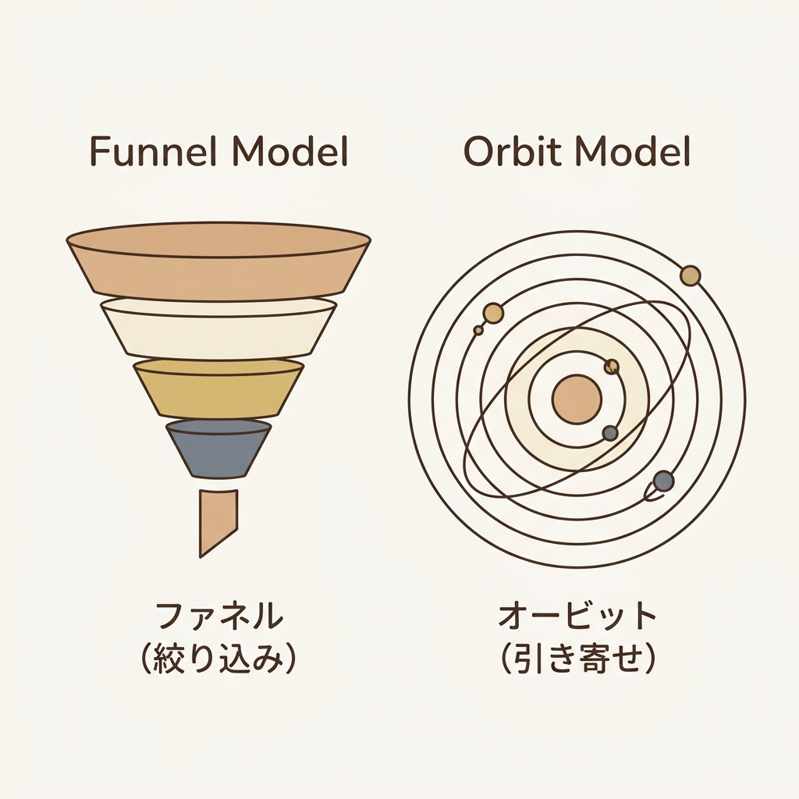
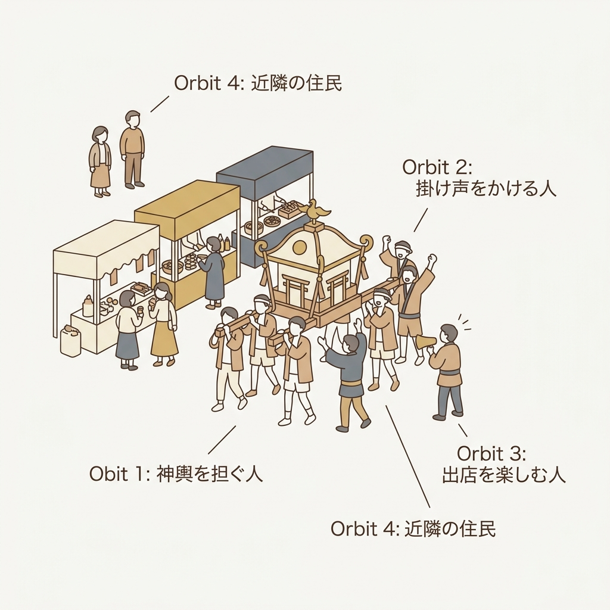
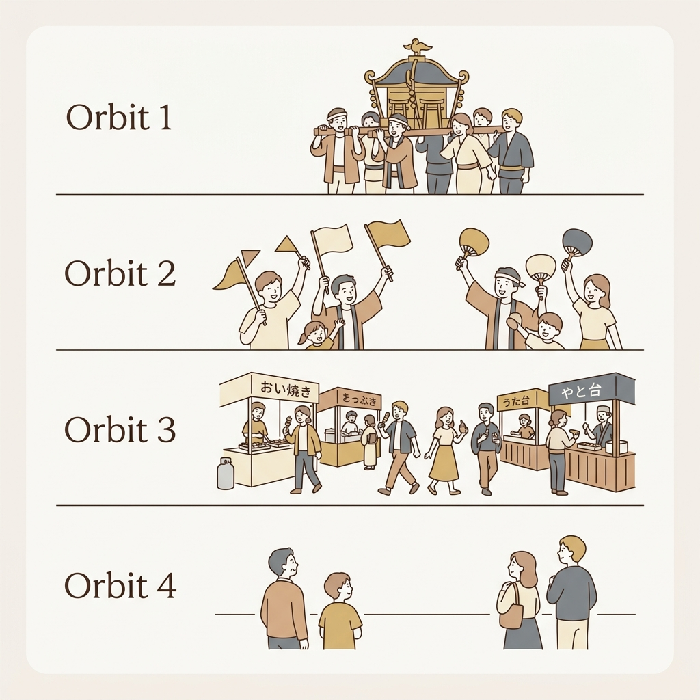

# 100人規模のコミュニティで起きた「協力者の自然発生」と、最近出会った「Orbit Model」の話

「僕も、このコミュニティでイベントを企画していいですか？」

no me in agileというコミュニティを立ち上げて、メンバーが50名前後になった頃。何人かのメンバーから、そんな信じられないくらい嬉しい言葉をもらいました。

創設者として一人で細々と運営していた身としては、これ以上ない喜びでした。

この自発的な盛り上がりが大きな推進力となり、コミュニティは急速に拡大し、いつしかメンバー数は100名規模へと押し上げられていきました。

しかし同時に、メンバーが増えるにつれて、私の心の中では「どうしよう」という焦りと不安が、じわじわと押し寄せていました。

「自発的に手を挙げてくれた彼らの熱量を、私はどうやってサポートすればいいんだろう？」
「急激にコミュニティが活発になる中で、これまで大切にしてきた『居心地の良さ』や『安心できる場』が壊れてしまわないだろうか？」

メンバーが前に出て活発に動き始めると、まだ心の準備ができていない人や、ただ静かに話を聞いて見守っていたいだけのメンバーが疎外感を感じて、場がぎくしゃくしてしまうのではないか…。そうならないようにするために、私はコミュニティオーナーとして何ができるのか。もしもそんな時が来たら、どうすればいいのか…。そんな漠然とした不安がありました。

管理は一人で行いつつも、周りに生まれ始めた自発的な協力者たちと、静かに見守りたいメンバーたち。その多様な「関係性のデザイン」と「安心できる場の両立」について深く悩み、模索し続けていた中で、最近出会ったのが、今回ご紹介する **「Orbit Model（オービットモデル）」** という考え方です。

私が悩んできた「生まれた熱量をどう持続させるか」「安心できる場をどう守るか」という問い。その本質を捉え、これから実践していくためのヒントが、従来の「人を絞り込む」**「マーケティングファネル（漏斗モデル）」**ではなく、関係性を「引き寄せ、それぞれの心地よい距離感を認める」 **Orbit Model**の考え方の中にあると感じています。まだちゃんと実践しているわけではなく、最近少しずつ学んで取り入れていこうとしている段階のため、本記事ではあくまで「こんなフレームワークがあるんだ」というのを知ってもらうことを目的に書いていきます。

---

## なぜ、人を巻き込むプロジェクトやコミュニティに「ファネル」は合わないのか？

従来のマーケティングでよく使われる「ファネル（Funnel）」や、購買プロセスモデル（AIDMAなど）は、多くの人に知ってもらい（認知）、そこから興味を持つ人を「絞り込んでいく」モデルです。

ファネルは一方向のプロセスであり、最終的なゴール（購入や参加）に到達した時点で、関係は「終点」を迎えます。これは言わば、**「ターゲットをフィルタリングして減らし、成果を『刈り取る』」**仕組みです。

しかし、共創プロジェクトやコミュニティは異なります。
参加したメンバーが他の人を呼び込み、互いにアイデアを出し合い、価値を広げていく **「価値が自己増幅する多方向のネットワーク」**です。

ファネルの考え方のままだと、自発的に「イベントをやりたい」と手を挙げてくれた協力者を「集客してくれる人」としてしか捉えられなくなってしまいます。また、ファネルの「最後（購入や積極的な活動）」に到達しないライトなメンバーを「離脱した（価値のない）人」として扱ってしまうことになります。

これでは、ライトに在籍して見守りたいだけのメンバーの居心地を悪くし、結果的に「安心できる場」を壊してしまうことになります。

それに何より、私が大切にしたいとっている **no me in**というコンセプトともズレてしまう気もしています。このコンセプトは、「私」というエゴを廃し、全員が「私も」と主体的に参加・発信・行動できる、そんなコミュニティを目指したものです。（幹事だから飲み会で酔っちゃだめではなく、みんなで酔っ払いたい！的な。笑）

そこで必要になるのが、**「Orbit Model（オービットモデル）」**へのシフトです。

---

## 新しい考え方：Orbit Model（オービットモデル）は「巻き込み・仲間づくり」の仕組み

Orbit Modelは、プロジェクトやコミュニティに関わる人々を **「太陽系（天体の軌道）」**のように捉えるモデルです。

太陽（＝プロジェクトやコミュニティの共通目的やビジョン）を中心に置き、その周りに関係者が異なる距離の「軌道（Orbit）」で回っていると考えます。

Orbit Modelの最も美しい考え方は、**「全員をコア（中心の軌道）に引き上げる必要はない」**ということです。それぞれのメンバーが、自分にとって最も居心地の良い「軌道（距離）」に留まることを認め、歓迎します。

これ、めっちゃ良くないですか？ずっと中心にいるのも疲れるし、外に居続けるのが退屈になったら自由に内外を行き来してもOKなんですよ。

### Orbit Modelの源流と海外での広がり

このフレームワークは、2014年頃に海外のエンジニアコミュニティや「DevRel（Developer Relations：開発者との関係性構築）」の現場で活躍する**Josh Dzielak（ジョシュ・ジェラク）**や**Patrick Woods（パトリック・ウッズ）**らによって考案され、2019年にオープンソースとして一般公開されました。

従来の「刈り取る（ファネル）」発想がコミュニティのダイナミクスに合わないという強い問題意識から生まれ、今ではGitHubやCircleCI、dbt Labsといった世界的なテック企業やオープンソースコミュニティなどで、関係性を測定・構築するための標準的なフレームワークとして広く活用されています。

最近ではテック業界の枠を超えて、「人を絞り込まず、巻き込みながら価値を生み出していく」すべてのプロジェクトやコミュニティ運営において注目され始めている考え方です。単なる概念の理解にとどまらず、実際のコミュニティ運営ツールやダッシュボードを用いてデータ駆動で運用されています。

### 日本人に馴染みやすい「お祭り（神輿）」のアナロジー

このOrbit Modelの概念は、日本でお馴染みの **「お祭り」**に例えると非常に分かりやすくなります。

「no me in agile」にイベントオーナーが自然発生し始めた時というのは、「お祭りが盛り上がるにつれて、『自分も神輿（みこし）を担ぎたい！』『この出店（イベント）を出したい！』という仲間が集まってきた状態」でした。

この時、お祭りの主催者である私に求められたのは、彼らにどうやって神輿の担ぎ棒を渡し、一緒にお祭り（コミュニティ）の熱気（Gravity）を高めていくかを設計することでした。

しかし同時に、お祭りは「神輿を担ぐ人」だけでは成立しないんですよね。

- **Orbit 1: コアメンバー（神輿を担ぐ人）**
  - プロジェクトやコミュニティの核となる存在。自発的にイベントを主催（イベントオーナー）したり、周囲を引っ張る「共同推進者」です。
  - **（心がけていること）**: 自発的に「企画をしたい」と手を挙げてくれた人には、そのイベント限定のオーナー権限を渡し、コミュニティとしてはプラットフォームを提供する（名前を貸す）形を取ります。主催者の私は、当日は一緒になって盛り上がり、場を共に楽しむ裏方に徹します。すると、いつしか1人、また1人と「これやってみたい！」「あれやってみたい！」という企画を持ち込んでくれるイベントオーナーが現れるようになりました。
- **Orbit 2: アクティブな協力者（掛け声をかける人）**
  - イベント開催に向けて準備のサポートやアイデア出し、チャットでの積極的なリアクションなど、何らかの「貢献（Contribution）」をしてくれるメンバーです。
  - **（心がけていること）**: 常時の役割分担や「運営担当」などの固定的な役割はあえて作りません。階層的な壁を作らずフラットで居続けることで、誰でもその時々で自由に参加し、必要に応じてそっと距離を置ける心理的負担の低さを維持します。Aというイベントではオーナーを務めた人が、Bではオーナーではなく協力者として関わってくれるということも自然と増えていきました。
- **Orbit 3: 一般参加者（出店を楽しむ人）**
  - 主催されるイベントや飲み会に参加し、話を聞いたりLTをしたりと、積極的にコミュニティに参加しているメンバーです。
  - **（心がけていること）**: 企画の発案があった際、何でも無条件に受け入れるのではなく、「コミュニティの温度感やコンセプトに合っているか？」という軸（太陽）だけは主催者がしっかり守ります。これが、一般の参加者がいつでも安心して戻ってこられる「居心地の良い場」を維持することに繋がるかと思います。実際に、「何やるのか全くわからないけど、どうせ楽しいんだろうから来た」と参加者から言われた時は、企画面では反省しないといけないと思いながらも、とても嬉しかったですね。
- **Orbit 4: オブザーバー（近隣の住民）**
  - SNSのフォロワーやメルマガの読者など、「プロジェクトやコミュニティの存在を知っていて、静かに見守っている」関係者です。
  - **（心がけていること）**: 「イベントに来てほしい」といった能動的なアクションを強制せず、活動の気配をオープンに伝えるだけに留めることで、「参加しない自由（ただ見守る心地よさ）」を最大限制限なく認めます。

### Orbitレベルの特徴と役割一覧

それぞれの「軌道」における、プロジェクトやコミュニティでの具体的な役割や行動例は以下の通りです。

- **Orbit 1: コアメンバー（神輿を担ぐ人）**
  - **プロジェクトやコミュニティでの役割**: 共同推進者・アンバサダー
  - **具体的な行動例**: イベント限定のオーナー権限で企画を主催する、主催者と共に場を盛り上げる
- **Orbit 2: アクティブな協力者（掛け声をかける人）**
  - **プロジェクトやコミュニティでの役割**: 貢献者 (Contributor)
  - **具体的な行動例**: 固定役割を作らず、フラットな距離感でその時々の準備サポートや意見を出す
- **Orbit 3: 一般参加者（出店を楽しむ人）**
  - **プロジェクトやコミュニティでの役割**: 参加者 (Participant)
  - **具体的な行動例**: 温度感や主旨の合ったイベントや飲み会に参加する、聞くだけの参加
- **Orbit 4: オブザーバー（近隣の住民）**
  - **プロジェクトやコミュニティでの役割**: 観察者 (Observer)
  - **具体的な行動例**: 活動の気配（レポートやSNS発信など）を閲覧する、遠くから見守る

お祭りを盛り上げるためには、単に「参拝客（Orbit 3）」を増やすだけでなく、自然発生的に「神輿を担ぎたい（Orbit 1）」と言ってくれたメンバーを適切にサポートすることが必要です。

しかし同時に、**お囃子（はやし）の音を聞きながら遠くで見守っている地域の人（Orbit 4）に対しても、「そこにいるだけでお祭りの一部だよ」と存在を認め、安心感を与えること**が極めて重要です。すべての人が無理をして神輿を担ぐ必要はありません。

それぞれの距離感で楽しむことで初めて、「お祭りの温かいカルチャー（居心地の良さ）」が維持されるのです。

---

## 巻き込みを測る3つの指標

Orbit Modelでは、この「お祭りの熱気」や「巻き込み力」を以下の3つの指標で捉えます。

### 1. Love（熱量・当事者意識）

メンバーがプロジェクトやコミュニティにどれだけ深く関与しているか、その「当事者意識」の強さです。
「自発的にイベントを企画した」「他のメンバーをサポートした」といった能動的なアクションは、高い「Love」を示します。

### 2. Reach（つながりの広さ・影響力）

その人が持つ「ネットワークの広さ」です。社内外での人脈や発信力の高さがこれに該当します。
「Love（熱量）」が高く、かつ「Reach（影響力）」も高いメンバーは、プロジェクトやコミュニティを周囲に広げてくれる強力なインフルエンサー（アンバサダー）になります。

### 3. Gravity（重力・惹きつける力）

プロジェクトやコミュニティ全体が持つ「人を引きつける魅力（お祭りの熱気）」です。これは個々のメンバーの「Love」と「Reach」の総和によって生み出されます。
魅力的なビジョンと楽しそうなコラボレーションがあるプロジェクトやコミュニティは、重力（Gravity）が高まり、自然と新しい協力者を引き寄せます。

---

## まとめ：これからは「刈り取る」のではなく「重力を高める」

人を巻き込むプロジェクトやコミュニティを成功させるためには、従来の「ファネル（刈り取り）」の発想から脱却し、**「今いる関係者の軌道を一歩内側に進めるにはどうすればいいか？」**を考えることが重要です。（ビジネスの場では先に利益や数字を求めがちで、逆説的に考えようとしますが、急がば回れ的な感じになるのかな〜と私は思っています。）

- Orbit 4（見守り層）の人に、Orbit 3（イベント参加）になってもらうには？
- Orbit 3（イベント参加）の人に、Orbit 2（簡単な意見出しや協力）になってもらうには？
- 自然発生したOrbit 1（イベントオーナー）の熱量を、どうすれば無理なく持続させられるか？
- **そして、それぞれの軌道にいるメンバーの「心地よい距離感」を、どうすれば損なわずに尊重できるか？**

このように、メンバーそれぞれの「軌道」に合わせた適切な対話や関わり方を設計することが、プロジェクトやコミュニティの「重力（Gravity）」を高め、指示待ちではない自発的な「共創」を生む鍵となります。

no me in agile （というか私個人）は最近この概念に出会ったばかりですが、振り返ってみると、私たちが大切にしてきたフラットな関係性やお神輿のような場づくりは、このOrbit Modelの考え方と重なる部分が非常に多いな〜と感じています。これからこのモデルを実践し、模索しながら、みんなで心地よく神輿を担ぎ合えるお祭りへとしていきたいと考えています。

まずは、あなたのプロジェクトやチームに関わる人々が、現在どの「軌道（神輿との距離）」にいるのか、整理してみることから始めてみませんか？

---

**次回予告**
次回は、具体的にメンバーの「Love（熱量）」と「Reach（影響力）」をどう捉え、どう施策に落とし込むのかについてお話できればな〜と考えています。（ちゃんとした記事書けるかはわからない。笑）

※Orbit Modelは、米Orbit.co社が提唱し、オープンソース（CC BY-SA 4.0）で公開されている関係構築のためのフレームワークです。

（この記事が参考になった方は、ぜひ「スキ」やSNSでのシェアをお願いします！）
